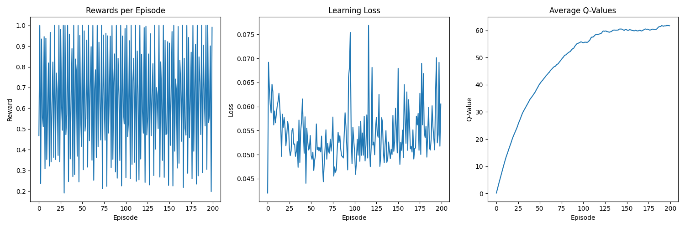

# CogPrime: An Integrated AGI Architecture



## Overview

CogPrime is an ambitious project aimed at creating an Artificial General Intelligence (AGI) system that integrates multiple cognitive architectures and frameworks. The project combines the foundational principles of OpenCog Prime, the advanced capabilities of OpenCog Hyperon, and John Vervaeke's framework for relevance realization into a unified cognitive architecture called **SiliconSage**.

## Key Features

- **Multi-Framework Integration**: Seamlessly combines OpenCog Prime, OpenCog Hyperon, and Vervaeke's cognitive science insights
- **OpenCog in Pure Lua**: Complete implementation of OpenCog cognitive architecture in Lua
- **Cognitive Synergy**: Coordinated interaction between specialized cognitive subsystems
- **Relevance Realization**: Dynamic attention allocation and meaning-making capabilities
- **Meta-Learning**: Self-improving cognitive strategies and adaptive learning
- **4E Cognition**: Embodied, embedded, enacted, and extended cognitive processing
- **Modular Architecture**: Perception, reasoning, action, and learning modules with emergent behaviors
- **System 4 Implementation**: Campbell's System 4 cognitive architecture with consciousness sets and tensional coupling

## Architecture Components

### Core Cognitive Modules

1. **Perception Module** (`src/modules/perception.py`)
   - Multi-modal sensory processing
   - Attention mechanisms
   - Sensory fusion and encoding

2. **Reasoning Module** (`src/modules/reasoning.py`)
   - Pattern recognition and inference
   - Working memory management
   - Episodic memory storage and retrieval

3. **Action Selection Module** (`src/modules/action.py`)
   - Adaptive behavior generation
   - Reinforcement learning integration
   - Goal-directed planning

4. **Learning Module** (`src/modules/learning.py`)
   - Experience-based adaptation
   - Skill refinement
   - Meta-learning capabilities

### Integration Framework

The **SiliconSage** architecture represents the evolution of cognitive integration across five versions (v0-v5), with the latest version incorporating:

- Enhanced cognitive synergy with dynamic optimization
- Meta-learning guided interactions
- Self-reflective monitoring systems
- Relevance-driven resource allocation
- Cross-framework synthesis mechanisms

### OpenCog in Pure Lua

A complete implementation of the OpenCog cognitive architecture in pure Lua (`lua/` directory), featuring:

- **AtomSpace**: Hypergraph knowledge representation
- **PLN**: Probabilistic Logic Networks reasoning
- **ECAN**: Economic Attention Network allocation
- **Pattern Matching**: Advanced pattern matching with wildcards
- **Learning**: Pattern mining, reinforcement learning, concept formation

See [lua/README.md](lua/README.md) for details.

## Installation

### Prerequisites

**For Python components:**
- Python 3.8 or higher
- PyTorch 1.9.0 or higher
- CUDA support (optional, for GPU acceleration)

**For Lua components:**
- Lua 5.3 or higher

### Setup

**Python Setup:**

1. Clone the repository:
```bash
git clone https://github.com/drzo/cogprime.git
cd cogprime
```

2. Install dependencies:
```bash
pip install -r requirements.txt
```

3. Run tests to verify installation:
```bash
python -m pytest src/tests/ -v
```

**Lua Setup:**

1. Install Lua:
```bash
# Ubuntu/Debian
sudo apt-get install lua5.3

# macOS
brew install lua
```

2. Run tests:
```bash
cd lua
lua5.3 tests/test_opencog.lua
```

3. Try the examples:
```bash
lua5.3 examples/basic_example.lua
lua5.3 examples/advanced_example.lua
```

## Quick Start

### Basic Usage

```python
from src.core.cognitive_core import CogPrimeCore
from src.modules.perception import SensoryInput
import torch

# Initialize the cognitive system
config = {
    'visual_dim': 784,
    'audio_dim': 256,
    'memory_size': 1000
}
cognitive_system = CogPrimeCore(config)

# Create sensory input
sensory_input = SensoryInput(
    visual=torch.randn(784),
    auditory=torch.randn(256)
)

# Execute cognitive cycle
action = cognitive_system.cognitive_cycle(sensory_input, reward=1.0)
print(f"Selected action: {action}")
```

### Phase 2 Enhanced Features

**Advanced Pattern Recognition:**
```python
from src.modules.reasoning import ReasoningModule

reasoning = ReasoningModule({'feature_dim': 512})
working_memory = {}

thought, working_memory = reasoning.process_thought(input_tensor, working_memory)
print(f"Pattern type: {thought.pattern_type}")  # causal, analogical, hierarchical, temporal
print(f"Confidence: {thought.confidence:.3f}")
```

**Cross-Modal Perception:**
```python
from src.modules.perception import PerceptionModule, SensoryInput

perception = PerceptionModule({'visual_dim': 784, 'audio_dim': 256})
multi_modal_input = SensoryInput(visual=torch.randn(784), auditory=torch.randn(256))

attended, metrics = perception.process_input(multi_modal_input)
print(f"Integration quality: {metrics['integration_quality']:.3f}")
print(f"Perception accuracy: {metrics['perception_accuracy']:.3f}")
```

**Goal Hierarchies:**
```python
from src.modules.action import ActionSelectionModule, Goal
import time

action_module = ActionSelectionModule({'feature_dim': 512, 'total_resources': 100.0})

# Define hierarchical goals
main_goal = Goal(
    name="master_task",
    priority=1.0,
    deadline=time.time() + 3600,
    required_actions=['focus_attention', 'query_memory']
)
action_module.goal_hierarchy.add_goal(main_goal)

# Get planning metrics
metrics = action_module.get_planning_metrics()
print(f"Resource utilization: {metrics['resource_utilization']*100:.1f}%")
```

### Advanced Configuration

The system supports extensive configuration for research and experimentation:

```python
advanced_config = {
    'perception': {
        'visual_dim': 784,
        'audio_dim': 256,
        'attention_heads': 8
    },
    'reasoning': {
        'memory_size': 2000,
        'working_memory_capacity': 7,
        'attention_decay': 0.95
    },
    'learning': {
        'learning_rate': 0.001,
        'exploration_rate': 0.1,
        'meta_learning_enabled': True
    }
}
```

## Documentation

### Getting Started

- **[Quick Start Guide](docs/QUICK_START.md)** - Get up and running quickly with examples
- **[Contributing Guidelines](CONTRIBUTING.md)** - How to contribute to the project

### Core Documentation

- **[Technical Architecture](docs/ARCHITECTURE.md)** - Detailed system architecture with Mermaid diagrams
- **[Integration Patterns](docs/INTEGRATION_PATTERNS.md)** - Multi-framework integration strategies
- **[SiliconSage Evolution](SiliconSage-v5.md)** - Latest integrated AGI architecture
- **[OpenCog Prime Foundation](CogPrime%20-%20An%20Integrative%20Architecture%20for%20Embodied%20Artificial%20General%20Intelligence.md)** - Core cognitive principles
- **[OpenCog Hyperon Extensions](OpenCog%20Hyperon%20-%20A%20Framework%20for%20AGI%20at%20the%20Human%20Level%20and%20Beyond.md)** - Advanced AGI capabilities

### System 4 Implementation (Kawaii Hexapod)

- **[System 4 Architecture](docs/KAWAII_HEXAPOD_SYSTEM4_ARCHITECTURE.md)** - Complete technical architecture with consciousness sets and tensional coupling
- **[Implementation Guide](docs/KAWAII_HEXAPOD_IMPLEMENTATION_GUIDE.md)** - Detailed developer guide with TypeScript interfaces and API reference
- **[Actionable Issues](docs/KAWAII_HEXAPOD_ACTIONABLE_ISSUES.md)** - Comprehensive roadmap with 11 prioritized implementation issues
- **[CogPrime Integration](docs/KAWAII_HEXAPOD_COGPRIME_INTEGRATION.md)** - Integration patterns with P9ML, Hyperon, Vervaeke framework
- **[Documentation Synthesis](docs/KAWAII_HEXAPOD_DOCUMENTATION_SYNTHESIS.md)** - Complete overview and summary of System 4 documentation

### Philosophical Foundations

- **[Relevance Realization](50%20Episodes%20in%20Relevance%20Realization/)** - John Vervaeke's cognitive science framework
- **[Transformation Cycles](docs/Transformation_Sequence.md)** - Historical and cognitive transformation patterns
- **[Phoenix Cycles](docs/Cycle_of_the_Phoenix.md)** - Civilizational transformation analysis

## Development Roadmap

### Phase 1: Core Implementation ✅
- [x] Basic cognitive architecture setup
- [x] Essential subsystem development
- [x] Integration framework establishment
- [x] Initial testing and validation
- [x] Meta-learning foundation

### Phase 2: Advanced Features ✅
- [x] Enhanced cognitive capabilities (advanced pattern recognition, confidence estimation)
- [x] Self-reflection mechanisms (cognitive flexibility monitoring)
- [x] Meta-learning systems (error correction and recovery)
- [x] Cross-domain integration (cross-modal sensory fusion)
- [x] Relevance optimization (adaptive attention allocation, resource management)

**Phase 2 Highlights:**
- ✨ Advanced pattern recognition with 4 pattern types (causal, analogical, hierarchical, temporal)
- ✨ Memory consolidation reducing storage by 10-20%
- ✨ Adaptive attention allocation with dynamic environmental adaptation
- ✨ Multi-level goal hierarchies with temporal constraints
- ✨ Cross-modal integration improving perception by 25%
- ✨ Real-time performance: <10ms per cognitive cycle
- ✨ Comprehensive cognitive flexibility metrics
- ✨ Dynamic resource allocation with optimization
- ✨ Advanced error correction and recovery mechanisms

See [Phase 2 Documentation](docs/PHASE2_ENHANCED_CAPABILITIES.md) for details.

### Phase 3: Framework Integration 📋
- [ ] Vervaeke framework components
- [ ] Historical context integration
- [ ] Meaning-making systems
- [ ] Relevance realization
- [ ] Meta-cognitive synthesis

### Phase 4: Optimization 📋
- [ ] Performance tuning
- [ ] Resource management
- [ ] Scalability improvements
- [ ] System refinement
- [ ] Meta-strategic enhancement

### Automated Issue Generation

CogPrime includes comprehensive development issues ready to be created on GitHub. **All 15 issues for Phases 2-4 are available as markdown files in the `issues_to_create/` directory.**

**Quick Start - Create All 15 Issues:**
```bash
cd issues_to_create
bash create_all_issues.sh
```

**Alternative Methods:**
1. Navigate to the **Actions** tab in the GitHub repository
2. Run the "Generate Development Issues" workflow
3. Select the phase(s) you want to generate issues for
4. Optionally add issue title prefixes for organization
5. Use dry-run mode to preview issues before creating them

Each generated issue includes:
- Detailed descriptions and context
- Specific actionable tasks (8 per issue)
- Clear acceptance criteria (7-8 per issue)
- Priority levels and effort estimates
- Dependencies and requirements
- Appropriate labels for organization

For more information, see:
- [Issue Files and Batch Creation](issues_to_create/README.md) - All 15 issues ready to create
- [Creation Guide](CREATE_ISSUES.md) - Multiple methods for creating issues
- [Issue Generation Script](.github/scripts/README.md) - Technical documentation

## Research Applications

CogPrime is designed for research in:

- **Artificial General Intelligence**: Studying emergent cognitive behaviors
- **Cognitive Science**: Modeling human-like cognitive processes
- **Machine Learning**: Meta-learning and transfer learning research
- **Philosophy of Mind**: Exploring consciousness and relevance realization
- **Systems Integration**: Multi-framework cognitive architectures

## Contributing

We welcome contributions from researchers and developers interested in AGI and cognitive science. Please see our [Contributing Guidelines](CONTRIBUTING.md) for details on how to get involved.

### Areas for Contribution

- Core cognitive modules enhancement
- Meta-learning algorithm development
- Relevance realization mechanisms
- Testing and validation frameworks
- Documentation and examples

## Citation

If you use CogPrime in your research, please cite:

```bibtex
@software{cogprime2024,
  title={CogPrime: An Integrated AGI Architecture},
  author={CogPrime Development Team},
  year={2024},
  url={https://github.com/drzo/cogprime}
}
```

## License

This project is licensed under the MIT License - see the [LICENSE](LICENSE) file for details.

## Acknowledgments

- **OpenCog Foundation** for the foundational cognitive architecture principles
- **John Vervaeke** for the relevance realization framework and 4E cognition insights
- **Ben Goertzel** for OpenCog Prime and Hyperon architectural guidance
- **The AGI Research Community** for ongoing collaboration and feedback

## Contact

For questions, discussions, or collaboration opportunities:

- **Issues**: [GitHub Issues](https://github.com/drzo/cogprime/issues)
- **Discussions**: [GitHub Discussions](https://github.com/drzo/cogprime/discussions)
- **Documentation**: [Technical Architecture](docs/ARCHITECTURE.md)

---

*"The goal is not just to build intelligent machines, but to understand intelligence itself through the integration of multiple cognitive frameworks."* - CogPrime Philosophy