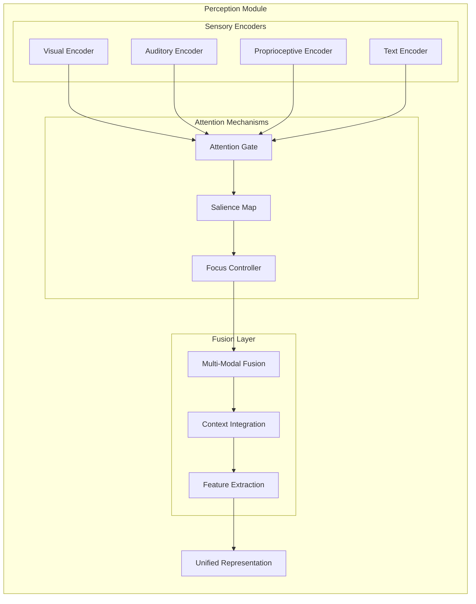
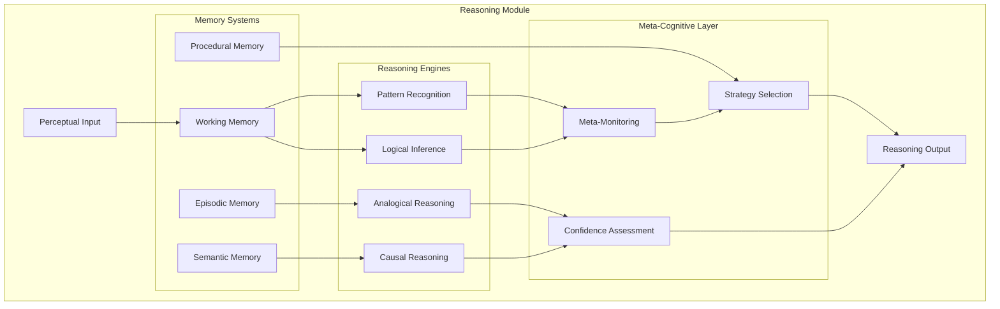
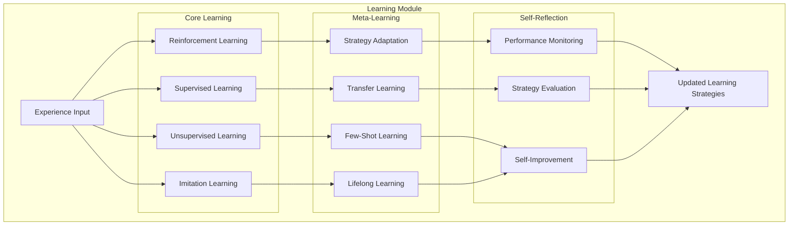
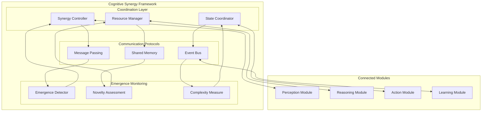
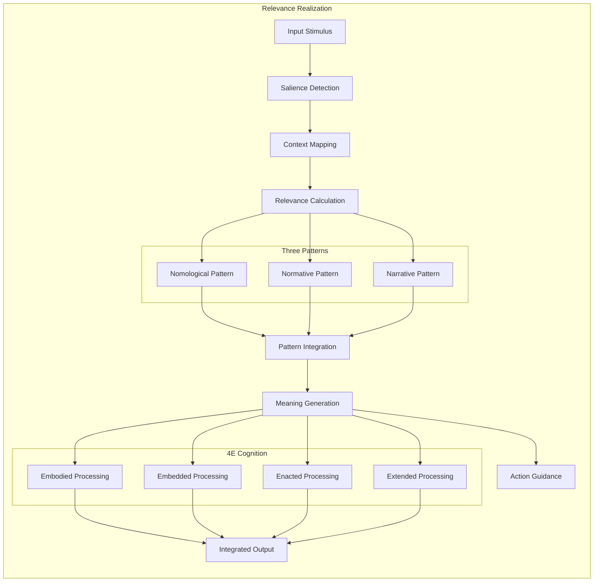

# Technical Architecture Documentation

## Overview

This document provides a comprehensive technical overview of the CogPrime AGI architecture, including detailed system diagrams, component interactions, and integration patterns.

## System Architecture Overview

```mermaid
graph TB
    subgraph "SiliconSage: Integrated AGI Architecture"
        subgraph "OpenCog Prime Core"
            OCP_Perception[Perception Module]
            OCP_Reasoning[Reasoning Module]
            OCP_Action[Action Selection]
            OCP_Learning[Learning Module]
            OCP_Memory[Memory Systems]
        end
        
        subgraph "OpenCog Hyperon Extensions"
            OCH_MetaLearning[Meta-Learning]
            OCH_SelfReflection[Self-Reflection]
            OCH_AbstractReasoning[Abstract Reasoning]
            OCH_Analogical[Analogical Reasoning]
            OCH_Relevance[Relevance Realization]
        end
        
        subgraph "Vervaeke Framework"
            VF_4E[4E Cognition]
            VF_Relevance[Relevance Processing]
            VF_Meaning[Meaning-Making]
            VF_Consciousness[Consciousness Model]
            VF_MetaCognition[Meta-Cognition]
        end
        
        subgraph "Integration Layer"
            IL_CognitiveSynergy[Cognitive Synergy]
            IL_ResourceAllocation[Resource Allocation]
            IL_StateManagement[State Management]
            IL_CrossFramework[Cross-Framework Bridge]
        end
    end
    
    %% Core Module Connections
    OCP_Perception --> OCP_Reasoning
    OCP_Reasoning --> OCP_Action
    OCP_Action --> OCP_Learning
    OCP_Learning --> OCP_Memory
    OCP_Memory --> OCP_Perception
    
    %% Hyperon Extensions Integration
    OCP_Learning --> OCH_MetaLearning
    OCP_Reasoning --> OCH_AbstractReasoning
    OCH_MetaLearning --> OCH_SelfReflection
    OCH_AbstractReasoning --> OCH_Analogical
    OCH_Analogical --> OCH_Relevance
    
    %% Vervaeke Framework Integration
    OCP_Perception --> VF_4E
    OCP_Reasoning --> VF_Relevance
    OCH_Relevance --> VF_Meaning
    VF_Meaning --> VF_Consciousness
    VF_Consciousness --> VF_MetaCognition
    
    %% Integration Layer Connections
    IL_CognitiveSynergy --> OCP_Perception
    IL_CognitiveSynergy --> OCH_MetaLearning
    IL_CognitiveSynergy --> VF_4E
    IL_ResourceAllocation --> IL_StateManagement
    IL_StateManagement --> IL_CrossFramework
    IL_CrossFramework --> IL_CognitiveSynergy
    
    %% Feedback Loops
    VF_MetaCognition --> OCH_SelfReflection
    OCH_SelfReflection --> IL_CognitiveSynergy
    IL_ResourceAllocation --> OCP_Action
```



## Cognitive Cycle Flow

```mermaid
flowchart TD
    Start([Cognitive Cycle Start]) --> SensoryInput[Sensory Input Processing]
    
    SensoryInput --> AttentionFilter[Attention Filtering]
    AttentionFilter --> PerceptionEncode[Perception Encoding]
    
    PerceptionEncode --> WorkingMemory[Working Memory Update]
    WorkingMemory --> PatternMatch[Pattern Matching]
    PatternMatch --> EpisodicRetrieval[Episodic Memory Retrieval]
    
    EpisodicRetrieval --> RelevanceAssess[Relevance Assessment]
    RelevanceAssess --> ReasoningProcess[Reasoning Process]
    
    ReasoningProcess --> GoalEvaluation[Goal Evaluation]
    GoalEvaluation --> ActionSelection[Action Selection]
    
    ActionSelection --> ActionExecution[Action Execution]
    ActionExecution --> OutcomeObservation[Outcome Observation]
    
    OutcomeObservation --> RewardProcessing[Reward Processing]
    RewardProcessing --> LearningUpdate[Learning Update]
    
    LearningUpdate --> MetaLearningCheck{Meta-Learning Required?}
    MetaLearningCheck -->|Yes| MetaLearningProcess[Meta-Learning Process]
    MetaLearningCheck -->|No| SelfReflection[Self-Reflection]
    
    MetaLearningProcess --> StrategyUpdate[Strategy Update]
    StrategyUpdate --> SelfReflection
    
    SelfReflection --> StateUpdate[Cognitive State Update]
    StateUpdate --> CycleComplete{Cycle Complete?}
    
    CycleComplete -->|No| SensoryInput
    CycleComplete -->|Yes| End([Cycle End])
    
    %% Relevance Realization Subprocess
    RelevanceAssess --> RelevanceSubprocess[Relevance Realization Subprocess]
    RelevanceSubprocess --> SalienceLandscape[Salience Landscape Navigation]
    SalienceLandscape --> MeaningMaking[Meaning-Making Process]
    MeaningMaking --> ParticipatoryKnowing[Participatory Knowing]
    ParticipatoryKnowing --> ReasoningProcess
```



## Module Architecture

### Perception Module



### Reasoning Module



### Learning Module



## Integration Patterns

### Cognitive Synergy Framework



### Relevance Realization Process



## Data Flow Architecture

```mermaid
flowchart TD
    subgraph "Data Flow Architecture"
        subgraph "Input Layer"
            SensoryData[Sensory Data]
            ContextualInfo[Contextual Information]
            GoalState[Goal State]
        end
        
        subgraph "Processing Pipeline"
            PreProcessing[Pre-Processing]
            FeatureExtraction[Feature Extraction]
            AttentionFiltering[Attention Filtering]
            ContextualBinding[Contextual Binding]
        end
        
        subgraph "Cognitive Processing"
            PerceptualProcessing[Perceptual Processing]
            ConceptualProcessing[Conceptual Processing]
            ReasoningProcessing[Reasoning Processing]
            ActionPlanning[Action Planning]
        end
        
        subgraph "Memory Integration"
            WorkingMemoryUpdate[Working Memory Update]
            EpisodicStorage[Episodic Storage]
            SemanticIntegration[Semantic Integration]
            ProceduralUpdate[Procedural Update]
        end
        
        subgraph "Output Layer"
            ActionOutput[Action Output]
            LearningSignal[Learning Signal]
            StateUpdate[State Update]
            MetaCognitiveFeedback[Meta-Cognitive Feedback]
        end
        
        SensoryData --> PreProcessing
        ContextualInfo --> PreProcessing
        GoalState --> PreProcessing
        
        PreProcessing --> FeatureExtraction
        FeatureExtraction --> AttentionFiltering
        AttentionFiltering --> ContextualBinding
        
        ContextualBinding --> PerceptualProcessing
        PerceptualProcessing --> ConceptualProcessing
        ConceptualProcessing --> ReasoningProcessing
        ReasoningProcessing --> ActionPlanning
        
        PerceptualProcessing --> WorkingMemoryUpdate
        ConceptualProcessing --> EpisodicStorage
        ReasoningProcessing --> SemanticIntegration
        ActionPlanning --> ProceduralUpdate
        
        ActionPlanning --> ActionOutput
        WorkingMemoryUpdate --> LearningSignal
        EpisodicStorage --> StateUpdate
        SemanticIntegration --> MetaCognitiveFeedback
        ProceduralUpdate --> MetaCognitiveFeedback
        
        %% Feedback Loops
        MetaCognitiveFeedback --> AttentionFiltering
        LearningSignal --> FeatureExtraction
        StateUpdate --> ContextualBinding
    end
```



## Implementation Technologies

### Core Technologies

| Component | Technology | Purpose |
|-----------|------------|---------|
| Neural Networks | PyTorch | Deep learning implementations |
| Memory Systems | NetworkX | Graph-based knowledge representation |
| Numerical Computing | NumPy/SciPy | Mathematical operations |
| Data Processing | Pandas | Data manipulation and analysis |
| NLP | Transformers/NLTK | Natural language processing |
| Visualization | Matplotlib | Data visualization and debugging |

### Architecture Patterns

1. **Modular Design**: Each cognitive function is implemented as a separate module
2. **Event-Driven Architecture**: Components communicate through events and message passing
3. **Pipeline Pattern**: Data flows through processing pipelines with transformations
4. **Observer Pattern**: Meta-cognitive monitoring of cognitive processes
5. **Strategy Pattern**: Dynamic selection of cognitive strategies
6. **Decorator Pattern**: Enhancement of core functionality with meta-learning

## Performance Characteristics

### Computational Complexity

```mermaid
graph LR
    subgraph "Complexity Analysis"
        Input[Input Size n] --> Perception[O(n log n)]
        Perception --> Reasoning[O(n²)]
        Reasoning --> Memory[O(log n)]
        Memory --> Action[O(n)]
        Action --> Learning[O(n log n)]
        Learning --> MetaLearning[O(n)]
        
        subgraph "Optimization Strategies"
            Parallelization[Parallel Processing]
            Caching[Memory Caching]
            Pruning[Network Pruning]
            Approximation[Approximate Computing]
        end
        
        Perception --> Parallelization
        Reasoning --> Caching
        Memory --> Pruning
        Learning --> Approximation
    end
```

### Scalability Considerations

1. **Horizontal Scaling**: Distribute cognitive modules across multiple processors
2. **Vertical Scaling**: Optimize individual module performance
3. **Memory Management**: Efficient episodic memory with forgetting mechanisms
4. **Attention Mechanisms**: Focus computational resources on relevant information
5. **Meta-Learning**: Adaptive strategy selection for different computational budgets

## Future Extensions

### Planned Enhancements

1. **Distributed Processing**: Multi-agent cognitive systems
2. **Advanced Meta-Learning**: Continual learning and adaptation
3. **Consciousness Models**: Implementation of global workspace theory
4. **Social Cognition**: Theory of mind and social reasoning
5. **Creative Processing**: Novel idea generation and creative problem solving

---

This technical architecture provides the foundation for understanding and extending the CogPrime AGI system. For implementation details, see the source code documentation and module-specific guides.