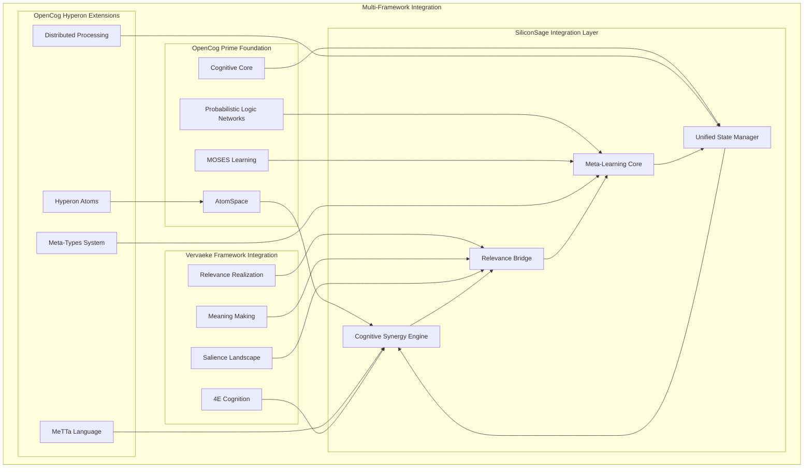
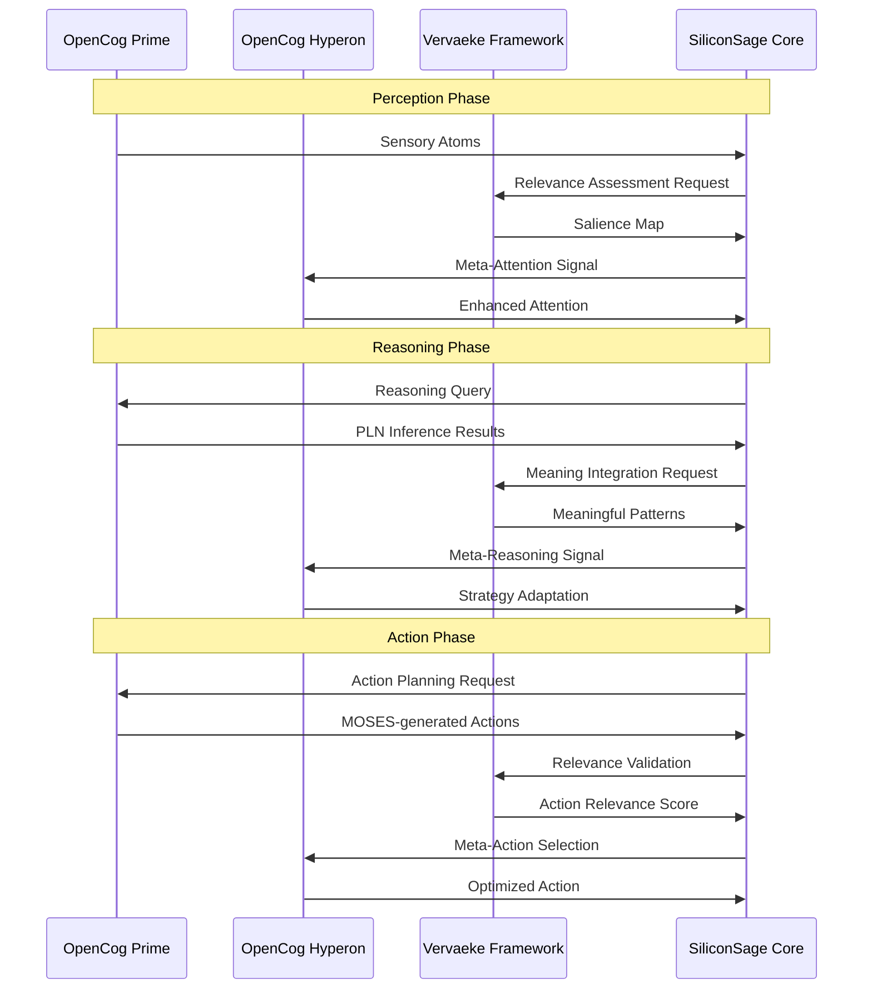
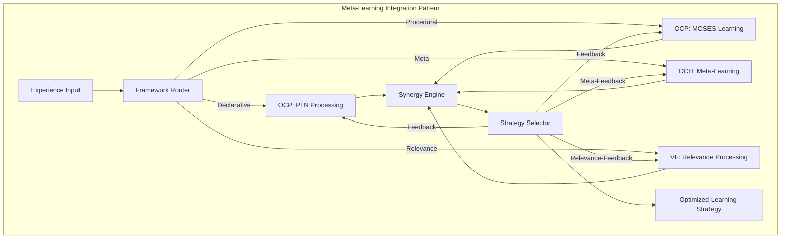
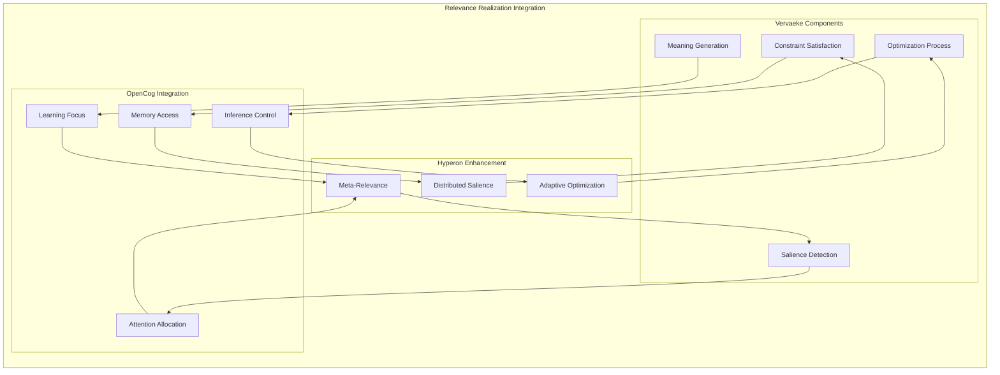
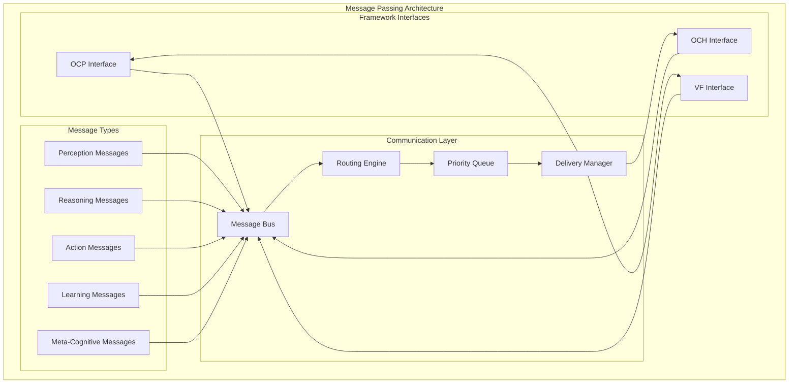
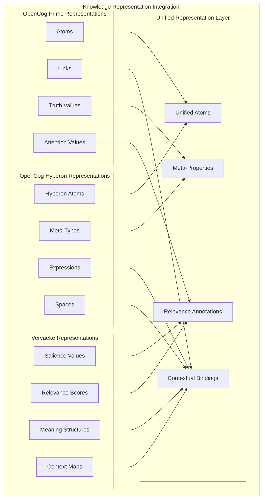
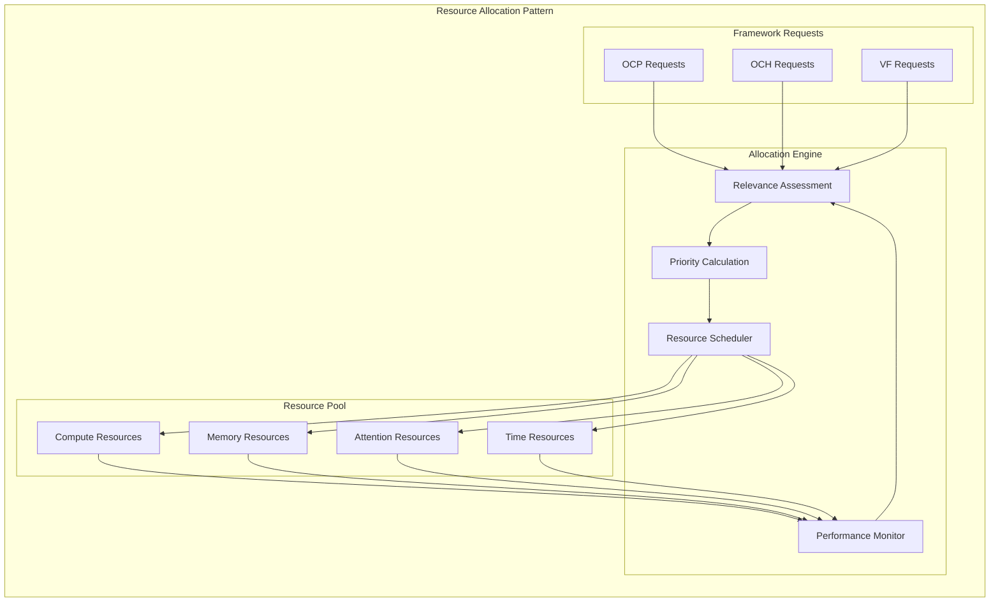

# SiliconSage Integration Patterns

This document details the specific integration patterns used in the SiliconSage architecture to combine OpenCog Prime, OpenCog Hyperon, and Vervaeke's framework.

## Framework Integration Architecture

## Cognitive Synergy Patterns

### Pattern 1: Cross-Framework Communication

### Pattern 2: Meta-Learning Integration

## Relevance Realization Integration

### Integration Pattern

## State Management Patterns

### Unified State Management

```mermaid
stateDiagram-v2
    [*] --> Initialization
    
    Initialization --> PerceptionState
    PerceptionState --> ReasoningState
    ReasoningState --> ActionState
    ActionState --> LearningState
    LearningState --> MetaCognitionState
    MetaCognitionState --> PerceptionState
    
    state PerceptionState {
        [*] --> SensoryProcessing
        SensoryProcessing --> AttentionFiltering
        AttentionFiltering --> FeatureExtraction
        FeatureExtraction --> [*]
    }
    
    state ReasoningState {
        [*] --> PatternMatching
        PatternMatching --> InferenceProcessing
        InferenceProcessing --> HypothesisGeneration
        HypothesisGeneration --> [*]
    }
    
    state ActionState {
        [*] --> GoalEvaluation
        GoalEvaluation --> ActionSelection
        ActionSelection --> ActionExecution
        ActionExecution --> [*]
    }
    
    state LearningState {
        [*] --> ExperienceProcessing
        ExperienceProcessing --> StrategyUpdate
        StrategyUpdate --> KnowledgeIntegration
        KnowledgeIntegration --> [*]
    }
    
    state MetaCognitionState {
        [*] --> PerformanceMonitoring
        PerformanceMonitoring --> StrategyAssessment
        StrategyAssessment --> SelfOptimization
        SelfOptimization --> [*]
    }
    
    MetaCognitionState --> Shutdown : System Halt
    Shutdown --> [*]
```

## Communication Protocols

### Inter-Framework Message Passing

## Data Integration Patterns

### Knowledge Representation Unification

## Performance Integration Patterns

### Resource Allocation Strategy

## Integration Validation

### Cross-Framework Consistency Checking

1. **Semantic Consistency**: Ensure that knowledge representations maintain semantic coherence across frameworks
2. **Temporal Consistency**: Synchronize temporal aspects of cognitive processes
3. **Causal Consistency**: Maintain causal relationships in cross-framework interactions
4. **Performance Consistency**: Balance computational load across frameworks

### Integration Testing Patterns

1. **Unit Integration Tests**: Test individual framework interfaces
2. **System Integration Tests**: Test complete cognitive cycles
3. **Performance Integration Tests**: Validate resource allocation efficiency
4. **Emergence Tests**: Validate emergent cognitive behaviors

---

These integration patterns provide the foundation for the successful synthesis of multiple cognitive frameworks in the SiliconSage architecture.