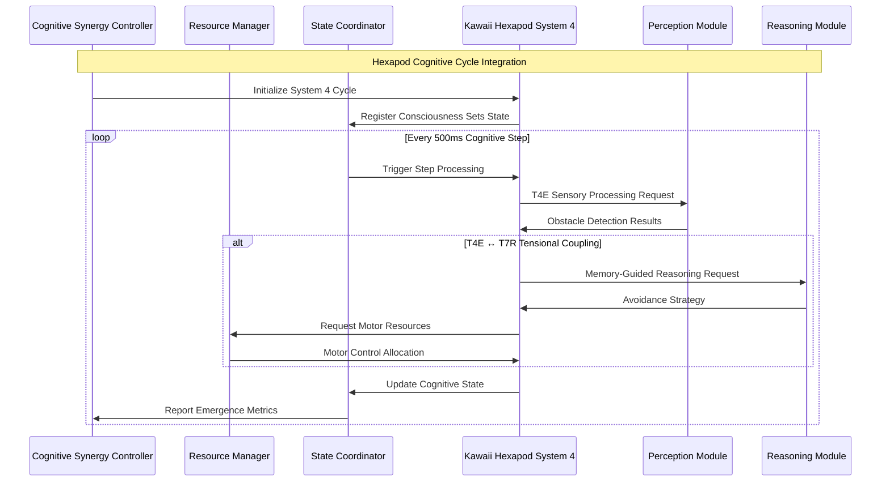

# Kawaii Hexapod System 4: CogPrime Integration Patterns

## Overview

This document describes how the kawaii-hexapod-system4.tsx component integrates with the broader CogPrime cognitive architecture, following the established patterns in the existing documentation.

## Integration Architecture

### Relationship to Existing CogPrime Components

```mermaid
graph TB
    subgraph "CogPrime Architecture"
        subgraph "OpenCog Prime Core"
            OCP_AtomSpace[AtomSpace]
            OCP_PLN[PLN Reasoning]
            OCP_CognitiveCore[Cognitive Core]
        end
        
        subgraph "OpenCog Hyperon"
            OCH_MeTTa[MeTTa Language]
            OCH_MetaLearning[Meta-Learning]
        end
        
        subgraph "Vervaeke Framework"
            VF_4E[4E Cognition]
            VF_Relevance[Relevance Realization]
        end
        
        subgraph "P9ML System"
            P9ML_Membranes[Membrane Computing]
            P9ML_Kernel[Cognitive Kernel]
        end
        
        subgraph "Kawaii Hexapod System 4"
            KHS_Engine[System 4 Engine]
            KHS_Consciousness[Consciousness Sets]
            KHS_Embodiment[Hexapod Embodiment]
        end
    end
    
    %% Integration Connections
    OCP_AtomSpace --> KHS_Engine : "Cognitive Atoms"
    OCH_MeTTa --> KHS_Consciousness : "Meta-Language Patterns"
    VF_4E --> KHS_Embodiment : "Embodied Cognition"
    VF_Relevance --> KHS_Engine : "Attention Allocation"
    P9ML_Membranes --> KHS_Consciousness : "Membrane States"
    P9ML_Kernel --> KHS_Engine : "Tensor Operations"
    
    KHS_Engine --> OCP_PLN : "Reasoning Requests"
    KHS_Consciousness --> OCH_MetaLearning : "Learning Patterns"
    KHS_Embodiment --> VF_4E : "Sensorimotor Data"
```

### Cognitive Synergy Framework Integration

The kawaii-hexapod-system4 component follows the established Cognitive Synergy Framework patterns:



## P9ML Membrane Computing Integration

### Membrane-to-Consciousness Mapping

```typescript
interface MembraneConsciousnessMapping {
  // Map System 4 consciousness sets to P9ML membranes
  consciousnessSetToMembrane: (setConfig: SetConfig) => P9MLMembrane;
  
  // Convert tensional couplings to membrane reactions
  tensionalCouplingToReaction: (coupling: TensionalCoupling) => MembraneReaction;
  
  // Transform cognitive cycles to membrane evolution
  cognitiveCycleToEvolution: (fromStep: number, toStep: number) => EvolutionRule;
}

const createMembraneMapping = (): MembraneConsciousnessMapping => ({
  consciousnessSetToMembrane: (setConfig) => ({
    id: `membrane_T${setConfig.term}_${setConfig.mode}`,
    objects: [`term_${setConfig.term}`, `mode_${setConfig.mode}`],
    rules: generateTermRules(setConfig.term, setConfig.mode),
    namespace: `kawaii_hexapod.consciousness.set_${setConfig.term}`,
    tensorShape: getTermTensorShape(setConfig.term),
    primeFactor: calculatePrimeFactor(getTermTensorShape(setConfig.term))
  }),
  
  tensionalCouplingToReaction: (coupling) => ({
    reactants: [coupling.source, coupling.target],
    products: [coupling.emergentBehavior],
    catalyst: coupling.environmentalTrigger,
    rate: coupling.strength,
    namespace: `kawaii_hexapod.tensional_coupling.${coupling.type}`
  }),
  
  cognitiveCycleToEvolution: (fromStep, toStep) => ({
    selector: `step_${fromStep}_to_${toStep}`,
    transformation: deriveStepTransformation(fromStep, toStep),
    fitness: calculateCognitiveFitness(fromStep, toStep),
    mutation: generateCognitiveMutation(fromStep, toStep)
  })
});
```

### Tensor Field Integration

```typescript
interface CognitiveFieldTensor {
  // Hexapod consciousness field tensor
  consciousnessField: Float32Array; // [3 sets, 6 terms, 2 modes]
  
  // Spatial embodiment tensor  
  embodimentField: Float32Array;    // [600 width, 400 height, 6 legs]
  
  // Emotional state tensor
  emotionalField: Float32Array;     // [3 emotions, temporal_depth]
  
  // Environmental interaction tensor
  environmentField: Float32Array;   // [obstacles, hexapod, interactions]
}

const generateCognitiveFieldTensor = (
  consciousnessSets: SetConfig[],
  hexapodState: HexapodState,
  environmentState: EnvironmentState
): CognitiveFieldTensor => {
  const consciousnessField = new Float32Array(3 * 6 * 2);
  const embodimentField = new Float32Array(600 * 400 * 6);
  const emotionalField = new Float32Array(3 * 10); // 10 temporal steps
  const environmentField = new Float32Array(100); // Max 100 entities
  
  // Populate consciousness field with set activations
  consciousnessSets.forEach((set, setIndex) => {
    const termIndex = [1,2,4,5,7,8].indexOf(set.term);
    const modeIndex = set.mode === 'E' ? 0 : 1;
    const tensorIndex = setIndex * 12 + termIndex * 2 + modeIndex;
    consciousnessField[tensorIndex] = 1.0;
  });
  
  // Populate embodiment field with spatial activations
  const hexapodX = Math.floor(hexapodState.position.x);
  const hexapodY = Math.floor(hexapodState.position.y);
  for (let legIndex = 0; legIndex < 6; legIndex++) {
    const spatialIndex = hexapodY * 600 * 6 + hexapodX * 6 + legIndex;
    if (spatialIndex < embodimentField.length) {
      embodimentField[spatialIndex] = hexapodState.legActivations[legIndex];
    }
  }
  
  // Populate emotional field with temporal emotional states
  const emotionIndex = ['happy', 'concerned', 'curious'].indexOf(hexapodState.emotionalState);
  for (let timeStep = 0; timeStep < 10; timeStep++) {
    emotionalField[emotionIndex * 10 + timeStep] = getEmotionalIntensity(timeStep);
  }
  
  return {
    consciousnessField,
    embodimentField,
    emotionalField,
    environmentField
  };
};
```

## OpenCog Hyperon MeTTa Integration

### Hexapod Cognitive Atoms

```metta
;; Define hexapod-specific cognitive atoms
(: HexapodAgent Type)
(: ConsciousnessSet Type)
(: CognitiveTerm Type)
(: ProcessingMode Type)

;; System 4 term definitions
(: T1 CognitiveTerm)  ; Perception (Need vs Capacity)
(: T2 CognitiveTerm)  ; Idea Formation
(: T4 CognitiveTerm)  ; Sensory Input
(: T5 CognitiveTerm)  ; Action Sequence
(: T7 CognitiveTerm)  ; Memory Encoding
(: T8 CognitiveTerm)  ; Balanced Response

;; Processing modes
(: Expressive ProcessingMode)
(: Regenerative ProcessingMode)

;; Tensional coupling predicates
(: TensionalCoupling (-> CognitiveTerm ProcessingMode CognitiveTerm ProcessingMode Bool))
(= (TensionalCoupling T4 Expressive T7 Regenerative) True)
(= (TensionalCoupling T1 Regenerative T2 Expressive) True)

;; Hexapod embodiment atoms
(: HexapodPosition (-> Number Number Number))
(: ObstacleField (-> (List Obstacle)))
(: EmotionalState (-> HexapodAgent (Union Happy Concerned Curious)))

;; Cognitive cycle inference
(: CognitiveCycle (-> HexapodAgent ConsciousnessSet ConsciousnessSet ConsciousnessSet))
(= (CognitiveCycle $agent $set1 $set2 $set3)
   (and (ActiveSet $agent $set1)
        (ActiveSet $agent $set2)
        (ActiveSet $agent $set3)
        (PhaseShifted $set1 $set2 $set3)))
```

### MeTTa Cognitive Processing Rules

```metta
;; Memory-guided perception rule
(= (MemoryGuidedPerception $agent $obstacle)
   (and (TensionalCoupling T4 Expressive T7 Regenerative)
        (NearestObstacle $agent $obstacle)
        (< (Distance $agent $obstacle) 100)))

;; Emotional state transition rules  
(= (EmotionalTransition $agent Happy)
   (and (MemoryGuidedPerception $agent $obstacle)
        (>= (Distance $agent $obstacle) 100)))

(= (EmotionalTransition $agent Concerned)
   (and (MemoryGuidedPerception $agent $obstacle)
        (< (Distance $agent $obstacle) 100)))

;; Motor execution rules
(= (ExecuteMovement $agent)
   (and (ActiveTerm $agent T8 Expressive)
        (EmotionalState $agent $emotion)))

;; Avoidance planning rules
(= (PlanAvoidance $agent $obstacle $newRotation)
   (and (EmotionalState $agent Concerned)
        (AngleToObstacle $agent $obstacle $angle)
        (- $newRotation $angle (* 0.3 180))))
```

## Vervaeke Framework Integration

### 4E Cognition Embodiment

The kawaii-hexapod implementation demonstrates all four aspects of 4E cognition:

```typescript
interface FourECognitionMapping {
  // Embodied: Physical hexapod form affects cognitive processing
  embodied: {
    hexapodMorphology: HexapodBodyPlan;
    sensoriomotorPatterns: LegCoordinationPatterns;
    spatialOrientation: PositionAwareness;
  };
  
  // Embedded: Cognitive processing shaped by environmental context
  embedded: {
    obstacleEnvironment: EnvironmentalContext;
    spatialConstraints: BoundaryConditions;
    resourceAvailability: EnergeticConstraints;
  };
  
  // Enacted: Cognition emerges through hexapod-environment interaction
  enacted: {
    explorationBehaviors: ExplorationPatterns;
    avoidanceBehaviors: AvoidanceStrategies;
    learningFromInteraction: AdaptiveBehaviors;
  };
  
  // Extended: Cognitive processing extends beyond hexapod boundaries
  extended: {
    obstacleAsExtendedSenses: EnvironmentalIntegration;
    collectiveIntelligence: SwarmCognition;
    toolUseCapabilities: EnvironmentalManipulation;
  };
}
```

### Relevance Realization Integration

```typescript
interface RelevanceRealizationMapping {
  // Salience landscape for hexapod attention
  salienceLandscape: (environment: Environment) => SalienceMap;
  
  // Relevance filtering for cognitive processing
  relevanceFilter: (stimuli: SensoryInput[]) => FilteredInput[];
  
  // Meaning-making through embodied interaction
  meaningMaking: (interaction: HexapodEnvironmentInteraction) => SemanticContent;
  
  // Insight generation from tensional coupling
  insightGeneration: (coupling: TensionalCoupling) => Insight[];
}

const implementRelevanceRealization = (): RelevanceRealizationMapping => ({
  salienceLandscape: (environment) => {
    // Calculate salience based on obstacle proximity, movement direction, memory
    const salienceMap = new Map<EnvironmentalFeature, number>();
    
    environment.obstacles.forEach(obstacle => {
      const relevance = calculateObstacleRelevance(obstacle, environment.hexapod);
      salienceMap.set(obstacle, relevance);
    });
    
    return salienceMap;
  },
  
  relevanceFilter: (stimuli) => {
    // Filter sensory input based on current cognitive set configurations
    return stimuli.filter(stimulus => 
      isRelevantToCurrentCognition(stimulus, getCurrentCognitiveSets())
    );
  },
  
  meaningMaking: (interaction) => {
    // Extract semantic content from hexapod-environment interactions
    return {
      spatialMeaning: extractSpatialSemantics(interaction),
      temporalMeaning: extractTemporalSemantics(interaction),
      causalMeaning: extractCausalSemantics(interaction),
      emotionalMeaning: extractEmotionalSemantics(interaction)
    };
  },
  
  insightGeneration: (coupling) => {
    // Generate insights from tensional coupling patterns
    const insights: Insight[] = [];
    
    if (coupling.type === 'T4E_T7R') {
      insights.push({
        type: 'memory_guided_perception',
        content: 'Past experience shapes current perception',
        confidence: coupling.strength,
        applicability: ['obstacle_avoidance', 'path_planning']
      });
    }
    
    return insights;
  }
});
```

## SiliconSage Integration Patterns

### Unified State Management

```typescript
interface SiliconSageStateIntegration {
  // Map hexapod states to SiliconSage unified state management
  hexapodToUnifiedState: (hexapodState: HexapodState) => UnifiedCognitiveState;
  
  // Integrate with SiliconSage meta-learning core
  integrateMetaLearning: (learningData: CognitiveLearningData) => MetaLearningUpdate;
  
  // Connect to SiliconSage relevance bridge
  connectRelevanceBridge: (relevanceData: RelevanceData) => RelevanceBridgeUpdate;
}

const integrateSiliconSage = (): SiliconSageStateIntegration => ({
  hexapodToUnifiedState: (hexapodState) => ({
    perceptionState: {
      sensoryProcessing: hexapodState.sensorData,
      attentionFiltering: hexapodState.relevanceFiltering,
      featureExtraction: hexapodState.obstacleDetection
    },
    reasoningState: {
      patternMatching: hexapodState.memoryRecall,
      inferenceProcessing: hexapodState.tensionalCoupling,
      hypothesisGeneration: hexapodState.pathPlanning
    },
    actionState: {
      goalEvaluation: hexapodState.emotionalAssessment,
      actionSelection: hexapodState.motorPlanning,
      actionExecution: hexapodState.movementExecution
    },
    learningState: {
      experienceProcessing: hexapodState.episodicMemory,
      strategyUpdate: hexapodState.behaviorAdaptation,
      knowledgeIntegration: hexapodState.cognitiveIntegration
    },
    metaCognitionState: {
      performanceMonitoring: hexapodState.selfAssessment,
      strategyAssessment: hexapodState.strategyEvaluation,
      selfOptimization: hexapodState.selfImprovement
    }
  }),
  
  integrateMetaLearning: (learningData) => ({
    frameworkRouter: determineOptimalFramework(learningData),
    synergyEngine: calculateCognitiveSynergy(learningData),
    strategySelector: selectOptimalStrategy(learningData),
    feedbackLoop: generateMetaLearningFeedback(learningData)
  }),
  
  connectRelevanceBridge: (relevanceData) => ({
    relevanceRealization: calculateRelevanceRealization(relevanceData),
    fourECognition: integrate4ECognition(relevanceData),
    meaningMaking: extractMeaning(relevanceData),
    salienceLandscape: updateSalienceLandscape(relevanceData)
  })
});
```

This integration framework ensures that the kawaii-hexapod-system4 component operates as a cohesive part of the broader CogPrime architecture while maintaining its unique System 4 cognitive characteristics and embodied intelligence capabilities.